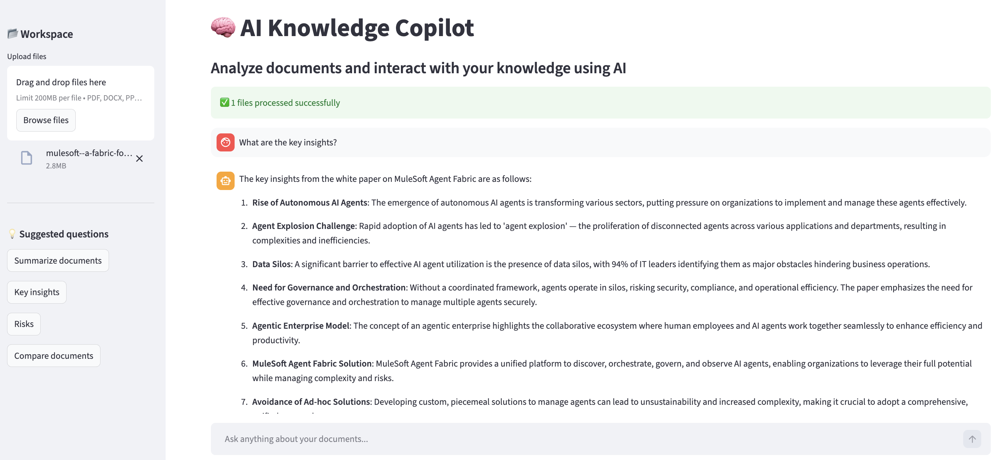

# 🧠 AI Knowledge Copilot

> Analyze documents, extract insights, and interact with your knowledge using AI.

---

## 🚀 Overview

**AI Knowledge Copilot** is a lightweight, production-ready AI application that allows users to:

- 📂 Upload multiple document types (PDF, DOCX, PPTX, CSV, TXT)  
- 🧠 Transform them into a unified knowledge base  
- 💬 Ask natural language questions  
- ⚡ Receive context-aware answers powered by AI  

This project demonstrates a **Retrieval-Augmented Generation (RAG-lite)** architecture with a clean, ChatGPT-style user experience.

---

## 🌐 🖥️ Live Demo

🚀 Try the app:  
https://ai-knowledge-copilot-qqurmsj8tcmzugptlwo245.streamlit.app/
> 
<p align="center">
  
</p>

> ⚠️ Demo environment — limited usage.
---

## 🎯 Why this project matters

Most AI demos stop at “chat with a PDF.”  

This project goes further by showing:

- Multi-document reasoning  
- Multimodal ingestion (documents + structured data)  
- Product-grade UX (chat interface, suggestions, feedback loop)  
- Deployment-ready architecture (Streamlit Cloud)  

---

## 🧠 Architecture

This app uses a simplified Retrieval-Augmented Generation (RAG) approach:
```
Documents → Text Extraction → Context Injection → LLM → Answer
```

### Key idea

Instead of using embeddings + vector databases, this version uses:

**Prompt-based retrieval (RAG-lite)**

This makes the system:
- Faster to build  
- Easier to deploy  
- Ideal for MVPs and demos  

---

## 🏗️ Tech Stack

| Layer | Technology |
|------|------------|
| UI | Streamlit |
| LLM | OpenAI GPT-4o-mini |
| PDF Parsing | PyPDF2 |
| Word Parsing | python-docx |
| PowerPoint Parsing | python-pptx |
| Data Processing | pandas |
| State Management | Streamlit session_state |

---

## 💡 Features

### 📂 Multi-Document Upload
- Upload multiple files at once  
- Supports:
  - PDF  
  - DOCX  
  - PPTX  
  - CSV  
  - TXT  

---

### 💬 Chat-Based Interface
- ChatGPT-style interaction  
- Ask questions across all uploaded documents  
- Maintains conversation history  

---

### ⚡ Suggested Questions
Quick-start prompts to guide users:
- Summarize documents  
- Key insights  
- Risks  
- Compare documents  

---

### 👍 👎 Feedback System
- Rate responses directly in the UI  
- Simulates human-in-the-loop learning  

---

### 🧠 Context-Aware Answers
- AI answers grounded in uploaded documents  
- Uses prompt injection of document content  

---

## 🖥️ Demo UI

- Sidebar = Workspace (file upload + prompts)  
- Main area = Chat interface  
- Real-time responses with loading indicators  

---

## ⚙️ Installation

### 1. Clone the repository

```bash
git clone https://github.com/YOUR_USERNAME/ai-knowledge-copilot.git
cd ai-knowledge-copilot
```
### 2. Create a virtual environment
```bash
python3 -m venv venv
source venv/bin/activate
```

### 3. Install dependencies
```bash
pip install -r requirements.txt
```

### 4. Set your OpenAI API key

Create a file:
```
.streamlit/secrets.toml
```
Add:
```TOML
OPENAI_API_KEY = "your_api_key_here"
```

### 5. Run the app
```bash
streamlit run app.py
```

## ☁️ Deployment (Streamlit Cloud)
1. Push repo to GitHub
2. Go to Streamlit Cloud
3. Connect your repo
4. Add your API key under "Secrets"
5. Deploy 🚀

## 🧠 How it works

### 1. Document ingestion

Each file is parsed and converted into plain text:

* PDFs → page text
* DOCX → paragraphs
* PPTX → slide content
* CSV → table-to-text
  
### 2. Context construction

All documents are combined into a single context:
```
Unified Knowledge Base
```
### 3. AI reasoning

The app sends:
```
[DOCUMENT CONTEXT] + [USER QUESTION]
```
to the model:

gpt-4o-mini

### 4. Response generation

The model generates answers grounded in the documents.

## ⚖️ Tradeoffs (Design Decisions)
|  Decision	|  Reason |
|----------|------------|
|No vector | DB	Simpler, faster MVP
|No embeddings |	Reduces complexity
|Context injection |	Works well for small-medium datasets

## ⚠️ Known Limitations (V1)

- Optimized for desktop usage  
- Some mobile-uploaded PDFs may fail due to encoding differences  
- OCR for scanned documents not yet supported  

Future versions will improve mobile compatibility and document processing robustness.

## 🔥 Future Improvements
* True RAG (FAISS / embeddings)
* Inline citations (like ChatGPT)
* Document comparison (structured diff)
* File tagging & filtering
* Memory across sessions
* Multimodal support (audio/video)

## 💼 Use Cases
* AI product demos
* Knowledge assistants
* Internal documentation search
* Customer support copilots
* Research synthesis tools

## 🧑‍💻 Author

**Juan Navarrete**  
Senior Product Manager — AI & ML  
📍 California

## ⭐ Support

If you like this project, give it a ⭐ on GitHub!
